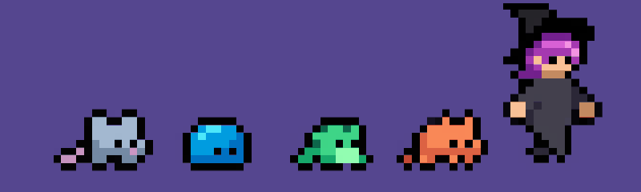

<h1>Hey, I'm Anastasiia </h1>
<p><em>AI master student at <a href="https://mai.thws.de/">Technische Hochschule Würzburg-Schweinfurt</a>
</em></p>

[](https://www.linkedin.com/in/anst-dem)
[](https://github.com/stDem)

### About...  

```javascript
 const anst = {
  pronouns: "she" | "her",
  code: [Python, JavaScript/TypeScript, HTML5, CSS/SCSS, SQL, C#],
  Python Frameworks & Libraries: [PyTorch, TensorFlow, Numpy, Pandas, Keras, Flask, scikit-learn],
  Web Frameworks & Libraries: [React JS, Vue.js, Bootstrap, Chakra UI, Material UI],
  languages: {
                        C1: "English",
                        B1: "German",
                      },
 study: "I am studying Master Artificial Intelligence at Technische hochschule Würzburg-Schweinfurt"
}
```

### AI projects:
- **GenAI, LLM**: Summarizing Dialogue (https://github.com/stDem/Generative-AI-with-LLMs);
- **ML, NLP, Web**: Dota2 draft prediction (https://github.com/stDem/Dota2-draft-prediction);
- **AI API, TS, React, Tailwind CSS**: AI Web Design Analysis (https://github.com/stDem/AI-Web-Design-Analysis);
- **Computer Vision, ML, Mobile app, Chatbot**: Fall detection (https://github.com/stDem/Fall-Detection-Project);
- **Deep Learning**: Handwritten characters classification (https://github.com/stDem/ANN-numpy-array-images);
- **Computer Vision**: All computer vision projects (https://github.com/stDem/Computer-vision–DeepLearning.AI-);
- **ML**: Motions classification (https://github.com/stDem/Motions-classification);
- **ML**: Classification of Onion dataset (https://github.com/stDem/Classification-of-Onion-dataset).


### Web projects:
- **TS, React, Tailwind CSS**: Personal website (https://github.com/stDem/Personal-website);
- **JS, HTML, SCSS, API**: Work Space website (https://github.com/stDem/WorkSpace---portfolio-site);
- **React, Chakra UI**: Old Portfolio website (https://github.com/stDem/Portfolio-site);
- **ReactJS, SCSS, API**: Little Lemon Restaurant website (https://github.com/stDem/Little-Lemon-website);
- **Vue.js, SCSS**: Interior Design website (https://github.com/stDem/InteriorDesign---portfolio-site);
- **JS, HTML, SCSS**: Auto Service website (https://github.com/stDem/AutoService—portfolio-site);
