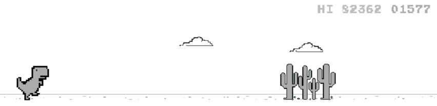

<h1>Hey, I'm Anastasiia </h1>
<p><em>AI master student at <a href="https://mai.thws.de/">Technische Hochschule Würzburg-Schweinfurt</a>
</em></p>

[](https://www.linkedin.com/in/anst-dem)
[](https://github.com/stDem)

### About...  

```javascript
 const anst = {
  pronouns: "she" | "her",
  code: [Python, Javascript, C#, Bash, SQL],
  tools: [Jupyter, Matplotplib, Numpy, Pandas, PyTorch, Tensorflow, Flask, Kivy],
  languages: {
                        fluent: "English",
                        beginner: "German",
                      },
 study: "I am studying Master Artificial Intelligence at Technische hochschule Würzburg-Schweinfurt"
}
```

### AI projects:


### Web projects:
